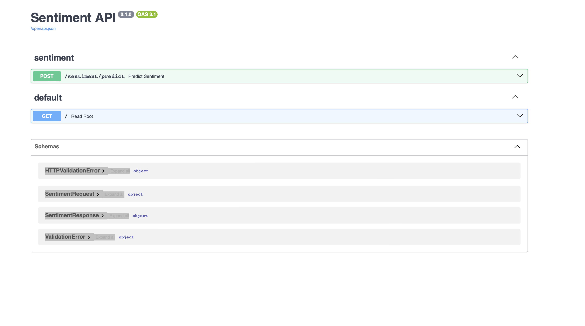
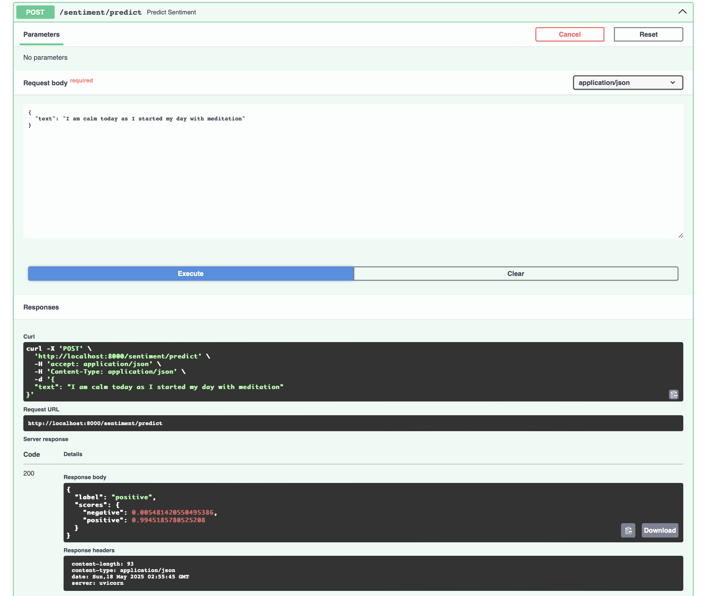
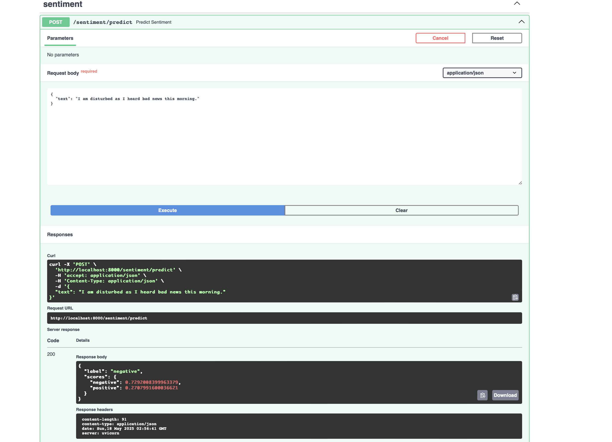

# Sentiment Analysis API

This project provides a FastAPI-based API for sentiment analysis of text. It uses a pre-trained RoBERTa model (fine-tuned on the `rotten_tomatoes` dataset by default) to classify text as either "positive" or "negative" and provides confidence scores.


## Features

* Predicts sentiment (positive/negative) of input text.
* Provides confidence scores for each label.
* Uses a fine-tuned RoBERTa model.
* Includes a script to retrain the model on the `rotten_tomatoes` dataset.
* Unit tests for API endpoints and core logic.
* Configurable model directory and sequence length via environment variables.
* Automatic device selection (CUDA, MPS, or CPU).

## Setup and Installation

1.  **Clone the repository:**
    ```bash
    git clone [https://github.com/iamshishirbhattarai/Fuse-Assignment-Sentiment-Classification.git](https://github.com/iamshishirbhattarai/Fuse-Assignment-Sentiment-Classification.git)
    cd Fuse-Assignment-Sentiment-Classification
    ```

2.  **Create and activate a virtual environment:**
    ```bash
    python -m venv venv
    source venv/bin/activate  # On Windows: venv\Scripts\activate
    ```

3.  **Install dependencies:**
    The `requirements.txt` file is already provided in the repository.
    ```bash
    pip install -r requirements.txt
    ```

4.  **Set up environment variables:**
    Copy `.env.example` to `.env` and modify as needed:
    ```env
    # .env
    APP_MODEL_DIR="model/rotten_roberta_sentiment"
    APP_MAX_SEQ_LENGTH="128"
    ```
    The default `APP_MODEL_DIR` assumes you have a trained model. If not, you'll need to run the retraining script first or download a pre-trained model into this directory. <br> <br>

5.  **Download/Retrain Model:**
    *   Run the retraining script:
        ```bash
        python scripts/retrain_model.py
        ```
        This will download the `rotten_tomatoes` dataset, fine-tune `cardiffnlp/twitter-roberta-base-sentiment-latest`, and save the model and tokenizer to the directory specified by `APP_MODEL_DIR` (default: `model/rotten_roberta_sentiment`).
   

## Running the Application

* Start the FastAPI application using Uvicorn: <br> <Br>

    ```bash
    uvicorn app.main:app --reload
    ```

* Paste the url in your browser:

    ```bash
    http://localhost:8000/docs 
    ```

## Screenshots


<br>

<br>



